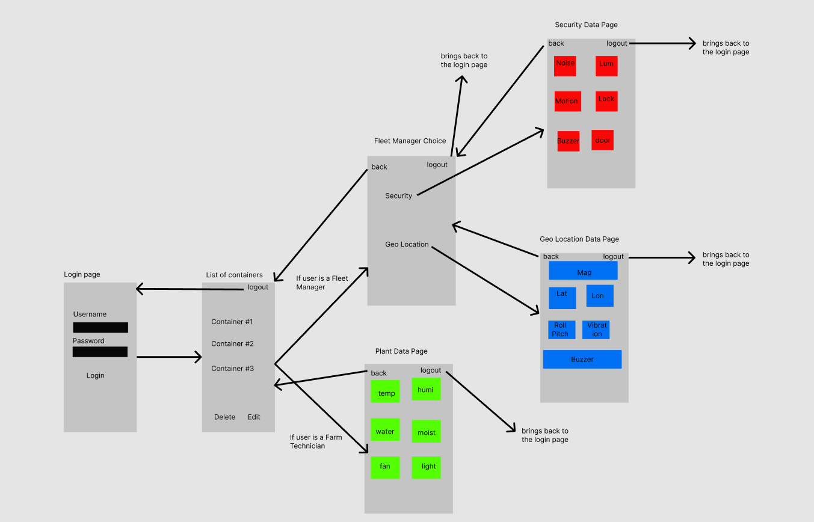

**App Design** 
# *Functional Overview*
The objective of this mobile application is to provide the farm technician and the supervisor remote control over certain systems in the container such as temperature, humidity, soil moisture levels amongst many more. The team will have control and remote supervision at all times by the means of the several graphs that display the overall data from the systems in the container and the notification feature. They are going to have real-time updates from the container which will allow them to act accordingly. This mobile application will also allow the users to use many other features such as sharing results and comparing data.   

# *Design Overview*
The farm application will consist of a minimum of 4 screens which should navigate between each other in order for users to make reading data and controlling hardware easier. 

**Screen 1:** User authentication allows the Farm Technician or the Fleet Manager to login

**Screen 2:** Farm Technician/Fleet manager(Depending on user login) View basic stats 

corresponding to their roles. Clicking on one of the stats will navigate to screen 3 which will display more detailed and accurate stats on the corresponding data as well as control hardware respectively . 

**Screen 3:** Farm Technician/Fleet manager(Depending on user login) View Detailed stats corresponding to their roles such as graphs, times etc… as well as control hardware if needed. 

**Screen 4:** Register page: A special user like quality assurance employee can register and view certain data in order to provide real-time feedback on any data that they see

Design is subject to change.
###
###
###
###

###

# Documentation 
[Final Documentation](https://docs.google.com/document/d/1MJE9n-6_iBg83kLa6mhFLTxDRj8lQrlUBzgabAzsaEA/edit?usp=sharing)

# *Prioritization of features:*
Must Develop:

\-   	Different views of graphs for the different type of data collected

\-   	Different view and access for the supervisor and employee

\-   	Notification and Alerts in case of emergencies

\-   	Sharing through different platforms (email, messages, text files)

\-   	Database that stores the data from the container

\-	Sending and receiving messages using azure

\-	Processing data and proceeding accordingly 

\-	User Friendly UI 

\-	Map Navigation to container location

Would Like to Develop:

\-   	User authentication for supervisor and employee (login)

   	

Could Develop if time permits:

\-  Dark Mode

\-	User Management		

\-  Auto complete of text box or forms

\-  Sharing through different platforms (email, messages, text files)

Likely will not develop due to lack of time:

\-   	Chatting platform 

\-	Container connects to nearby bluetooth devices so that it can notify nearby partnerships that the product is on the go.	

###
# *Proposed Implementation Schedule*
###
**Sprint 2: April 25 to May 2**

- Create Models, ViewModels
- Create Basic Design
- Create Dummy Data

**Sprint 3: May 2 to May 9**

- Figure out how to connect azure with Xamarin forms to send and receive data
- Try to implement all the features in this sprint
- Working with device twins, message routing, and storage blobs

**Sprint 4: May 9 to May 16**

- Finish implementation of all the features
- Implement extra features

**Sprint 5: May 16 to May 23**

- Finalize main finishing touches and fix bugs
- Review everything and make sure it is all implemented
- Finalize extra features
- Presentation to the teachers

# *Potential Showstoppers and Open Questions*
As a team we need to be familiar with the design pattern chosen, thus we can all follow that pattern and design our individual screens without hesitation.  

For this final project, we are receiving new hardware. Therefore, we have to familiarize ourselves with those. Given the time constraint, learning those hardware components could be quite a challenge.

Connecting the back end with a raspberry pi device will be something that we will be doing for our first time therefore there could be a lot of confusion that could arise. 

